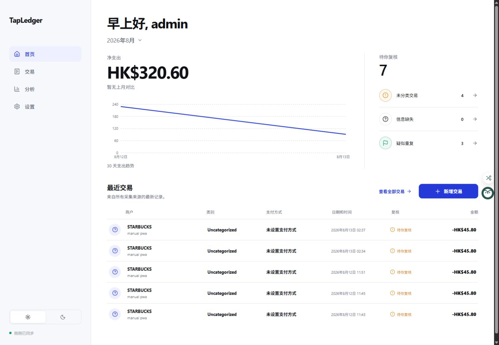

# TapLedger

TapLedger 是一套单用户、自部署的个人记账 PWA。现有 React/Vite 界面保持不变，网页、`/api/v1/*` Worker API 与 D1 数据库部署在每位用户自己的 Cloudflare 账户中。

[](https://deploy.workers.cloudflare.com/?url=https://github.com/18566257757/TapLedger)



## 功能

- 首页、交易列表与编辑器、Review Inbox、分析、类别、支付方式、商户规则和设置。
- 整数最小货币单位与 ISO 4217 币种，多币种不做隐式汇率合并。
- Cookie 会话、CSRF、独立 Shortcut Bearer token、`client_event_id` 幂等和重复候选识别。
- CSV 导出、JSON 导出、D1 内校验备份与密码保护恢复。
- 同源 PWA、手机底部导航、桌面侧栏、浅色/深色模式和离线待同步队列。

## 部署到自己的 Cloudflare

要求 Node.js `>=20.19`、npm、Git 和可登录的 Cloudflare 账户。在项目根目录运行：

```powershell
npm ci
npm run deploy:current
```

脚本会运行全部质量检查，使用项目内 Wrangler 完成浏览器登录，创建被 Git 忽略的 `wrangler.instance.jsonc` 和私有 D1，应用迁移、构建、部署并验证远程首页、D1 health 与 SPA 深链。不要把 API Token、密码或 Secret 粘贴到聊天、配置或 Git 中。

公共 `wrangler.jsonc` 只是一键部署模板，不含 account ID、database ID、固定 Worker URL 或 Secret。当前实例信息只保存在被忽略的实例配置中。

## 本地开发

```powershell
npm ci
npm run db:migrate:local
npm run dev
```

开发服务器使用本地 D1；前端始终请求相对 `/api/v1/...`，不会误写远程数据库。完整说明见 [本地开发](docs/LOCAL_DEVELOPMENT.md)。

## 隐私架构

```text
用户浏览器 / iPhone Shortcut
            ↓ HTTPS
用户自己的 Cloudflare Worker + Static Assets
            ↓ DB binding
用户自己的 Cloudflare D1
```

项目没有作者中央 API、中央数据库、遥测、广告、第三方分析、远程字体、CDN 或 AI API。记账功能不会把金额、商户、卡片、类别、位置或备注发送到其他域名。

## 文档

- [部署到 Cloudflare](docs/DEPLOY_TO_CLOUDFLARE.md)
- [本地开发](docs/LOCAL_DEVELOPMENT.md)
- [旧数据迁移](docs/DATA_MIGRATION.md)
- [Shortcut 设置](docs/SHORTCUT_SETUP.md)
- [Wallet 自动化](docs/WALLET_AUTOMATION_SETUP.md)
- [备份与恢复](docs/BACKUP_AND_RESTORE.md)
- [隐私架构](docs/PRIVACY_ARCHITECTURE.md)
- [安全策略](SECURITY.md) / [隐私声明](PRIVACY.md)
- [UI 冻结与迁移验证](docs/UI_MIGRATION_VERIFICATION.md)

## 开发质量门禁

```powershell
npm run lint
npm run typecheck
npm run test:unit
npm run test:integration
npm run test:frontend
npm run test:e2e
npm run visual:compare
npm run build
npm run publication:check
```

许可证：当前仓库尚未加入 LICENSE；复用或再分发前请先联系仓库所有者，后续版本将补充明确许可证。
