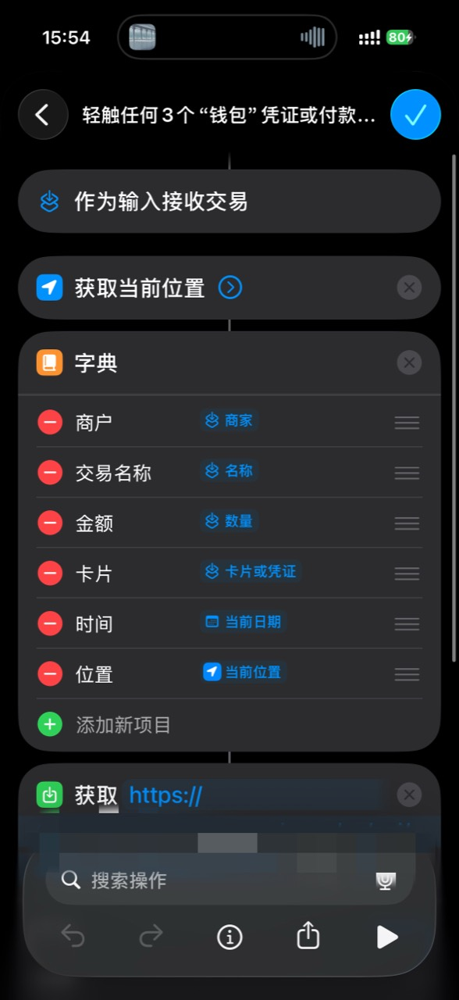
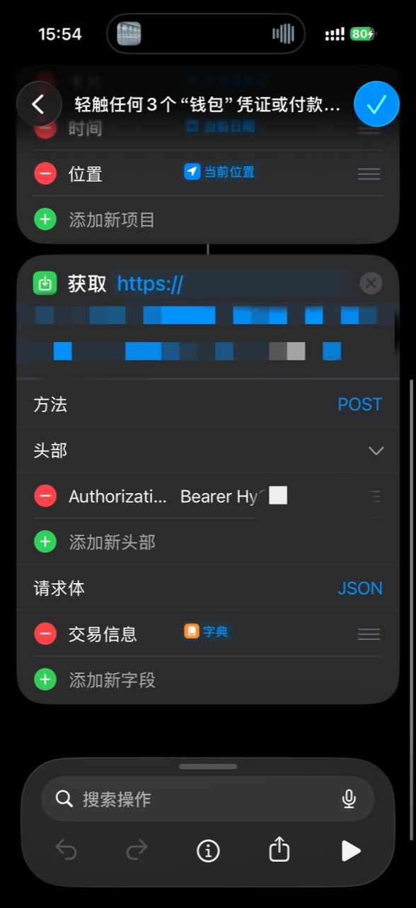

# TapLedger

[简体中文](#简体中文) · [English](#english)

[](https://deploy.workers.cloudflare.com/?url=https://github.com/18566257757/TapLedger)


## 简体中文

TapLedger 是一套单用户、自部署的个人记账 PWA。网页、`/api/v1/*` Worker API 与 D1 数据库都部署在你自己的 Cloudflare 账户中，不依赖项目作者的服务器。

### 最大特点：Apple Wallet 交易自动导入

在受支持的 iPhone、地区和银行卡上，TapLedger 可以接收 iOS 快捷指令“钱包 → 交易”个人自动化提供的交易字段，并在使用 Apple Pay/Wallet 轻触付款后自动导入商户、金额、卡片、时间和位置等信息。数据通过 Bearer Token 发送到你自己的 Worker，再写入你自己的 D1。

这不是商户收款功能 Apple Tap to Pay，也不会抓取银行账单。可用字段与触发行为由 iOS、地区、发卡行和具体交易决定；iPhone 个人自动化仍需由用户手动创建。参见 [Apple 官方的快捷指令交易触发器说明](https://support.apple.com/en-ie/guide/shortcuts/apd65c67538a/ios)。

### 快捷指令设置示例

请先在 TapLedger 设置页展开“自动化”，复制当前实例的 Import URL 并轮换 Shortcut Token。下面图片中的地址和 Token 已脱敏；不要把自己的完整 Token 上传到 GitHub、截图或聊天中。

<table>
  <tr>
    <td align="center"><br><sub>1. 从“钱包”交易输入建立字典</sub></td>
    <td align="center"><br><sub>2. 使用 Bearer Token 向 TapLedger 发送 JSON</sub></td>
  </tr>
</table>

完整步骤见 [Wallet 自动化](docs/WALLET_AUTOMATION_SETUP.md) 和 [Shortcut 设置](docs/SHORTCUT_SETUP.md)。

### 其他功能

- 首页、交易列表与编辑器、待审核队列、分析、类别、支付方式、商户规则和可折叠设置。
- 中文、繁体中文、英文界面与昵称设置；手机底部导航、桌面侧栏和浅色/深色模式。
- 整数最小货币单位与 ISO 4217 币种，多币种不做隐式汇率合并。
- Cookie 会话、CSRF、独立 Shortcut Bearer Token、`client_event_id` 幂等和重复候选识别。
- CSV/JSON 导出、D1 内校验备份、密码保护恢复和离线待同步队列。

### 部署到自己的 Cloudflare

要求 Node.js `>=20.19`、npm、Git 和可登录的 Cloudflare 账户。在项目根目录运行：

```powershell
npm ci
npm run deploy:current
```

脚本会执行质量检查，使用项目内 Wrangler 创建被 Git 忽略的 `wrangler.instance.jsonc` 和私有 D1，然后应用迁移、构建、部署并验证远程首页、D1 health 与 SPA 深链。不要把 API Token、密码或 Secret 写入聊天、配置或 Git。

公共 `wrangler.jsonc` 只是一键部署模板，不含 account ID、database ID、固定 Worker URL 或 Secret。

### 本地开发

```powershell
npm ci
npm run db:migrate:local
npm run dev
```

开发服务器使用本地 D1；前端始终请求相对 `/api/v1/...`，不会误写远程数据库。完整说明见 [本地开发](docs/LOCAL_DEVELOPMENT.md)。

### 隐私架构

```text
用户浏览器 / iPhone Shortcut
            ↓ HTTPS
用户自己的 Cloudflare Worker + Static Assets
            ↓ DB binding
用户自己的 Cloudflare D1
```

项目没有作者中央 API、中央数据库、遥测、广告、第三方分析、远程字体、CDN 或 AI API。记账功能不会把金额、商户、卡片、类别、位置或备注发送到其他域名。

### 文档与质量门禁

- [部署到 Cloudflare](docs/DEPLOY_TO_CLOUDFLARE.md)
- [本地开发](docs/LOCAL_DEVELOPMENT.md)
- [旧数据迁移](docs/DATA_MIGRATION.md)
- [备份与恢复](docs/BACKUP_AND_RESTORE.md)
- [隐私架构](docs/PRIVACY_ARCHITECTURE.md)
- [安全策略](SECURITY.md) / [隐私声明](PRIVACY.md)
- [UI 冻结与迁移验证](docs/UI_MIGRATION_VERIFICATION.md)

```powershell
npm run lint
npm run typecheck
npm run test:unit
npm run test:integration
npm run test:frontend
npm run test:e2e
npm run visual:compare
npm run build
npm run publication:check
```

## English

TapLedger is a single-user, self-deployed personal finance PWA. Its web app, `/api/v1/*` Worker API, and D1 database all run inside your own Cloudflare account—there is no developer-operated central service.

### Signature feature: import Apple Wallet transactions

On supported iPhones, regions, and cards, TapLedger can receive the transaction fields exposed by the iOS Shortcuts **Wallet → Transaction** personal automation after an eligible Apple Pay/Wallet tap. Merchant, amount, card, time, location, and other available fields are sent with a dedicated Bearer Token to your own Worker and stored in your own D1 database.

This is not the merchant payment-acceptance product Apple Tap to Pay, and TapLedger does not scrape bank statements. Field availability and trigger behavior depend on iOS, region, issuer, and transaction. The user must create the iPhone personal automation manually. See [Apple's official transaction-trigger documentation](https://support.apple.com/en-ie/guide/shortcuts/apd65c67538a/ios).

### Shortcuts setup example

Open **Settings → Automation** in TapLedger, copy the Import URL for your deployment, and rotate the Shortcut Token. The URL and token in these screenshots are redacted; never publish your own complete token.

<table>
  <tr>
    <td align="center"><br><sub>1. Build a dictionary from Wallet transaction input</sub></td>
    <td align="center"><br><sub>2. POST JSON with the dedicated Bearer Token</sub></td>
  </tr>
</table>

The screenshots use a Chinese iPhone interface. Follow [Wallet automation setup](docs/WALLET_AUTOMATION_SETUP.md) and [Shortcut setup](docs/SHORTCUT_SETUP.md) for the complete field mapping.

### Features

- Dashboard, transaction list/editor, review inbox, insights, categories, payment methods, merchant rules, and collapsible settings.
- Simplified Chinese, Traditional Chinese, and English UI with a configurable nickname, responsive navigation, and light/dark themes.
- Integer minor-unit money storage with ISO 4217 currencies; currencies are never silently converted or merged.
- Cookie sessions, CSRF protection, a separate Shortcut Bearer Token, `client_event_id` idempotency, and duplicate-candidate detection.
- CSV/JSON export, verified D1 backups, password-protected restore, and an offline pending queue.

### Deploy to your Cloudflare account

Requirements: Node.js `>=20.19`, npm, Git, and a Cloudflare account you can sign in to.

```powershell
npm ci
npm run deploy:current
```

The script runs the quality gates, creates a Git-ignored `wrangler.instance.jsonc` and private D1 database through the project-local Wrangler, applies migrations, builds, deploys, and verifies the remote home page, D1 health endpoint, and SPA deep links. Never put API tokens, passwords, or secrets in chat, configuration files, or Git.

The public `wrangler.jsonc` is a reusable deployment template and contains no account ID, database ID, fixed Worker URL, or secret.

### Local development

```powershell
npm ci
npm run db:migrate:local
npm run dev
```

Local development uses a local D1 database. The frontend always calls relative `/api/v1/...` paths, so local tests cannot accidentally write to production. See [local development](docs/LOCAL_DEVELOPMENT.md).

### Privacy architecture

```text
User browser / iPhone Shortcut
            ↓ HTTPS
User-owned Cloudflare Worker + Static Assets
            ↓ DB binding
User-owned Cloudflare D1
```

TapLedger has no developer-operated API or database, telemetry, ads, third-party analytics, remote font/CDN dependency, or AI API. Normal ledger operations do not send amounts, merchants, cards, categories, locations, or notes to another domain.

### License

TapLedger is available under the [PolyForm Noncommercial License 1.0.0](LICENSE): personal and other noncommercial use is permitted; commercial use is not. This is a source-available license, not an OSI-approved open-source license.

---

许可证：TapLedger 使用 [PolyForm Noncommercial License 1.0.0](LICENSE)，允许个人及其他非商业用途，禁止商业使用。该许可证属于 source-available（源码可用）许可证，不是 OSI 认可的开源许可证。
